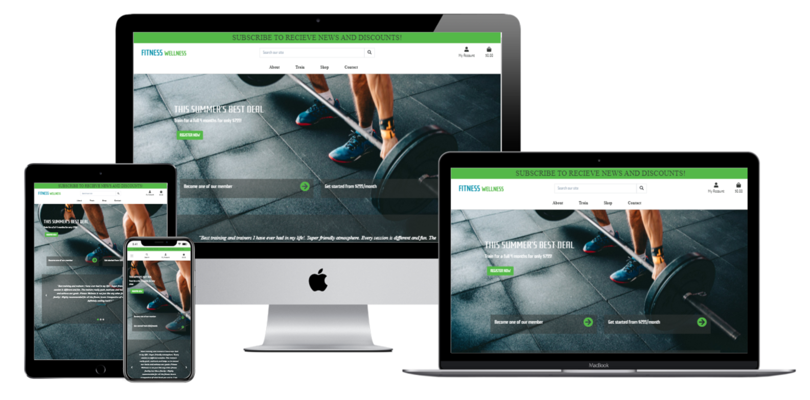
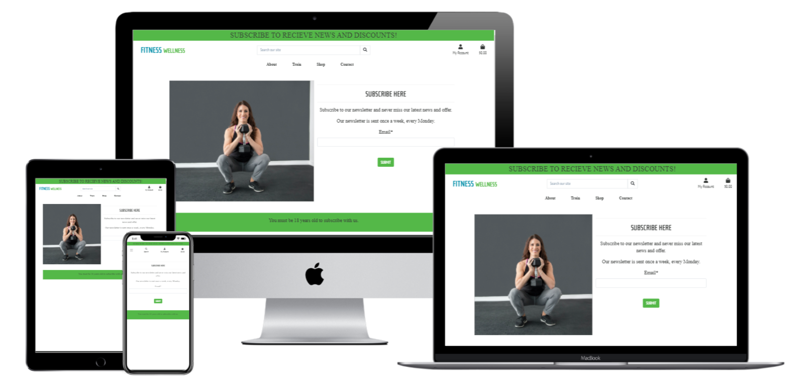
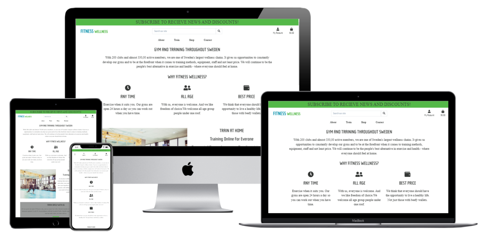
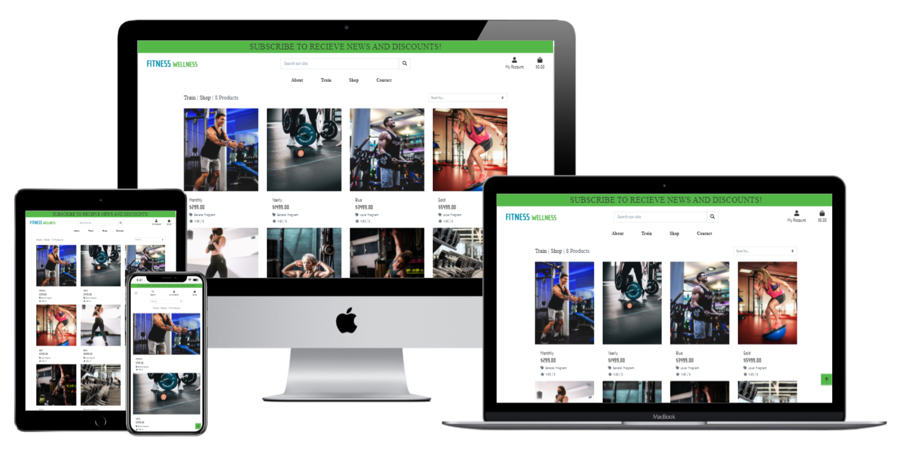
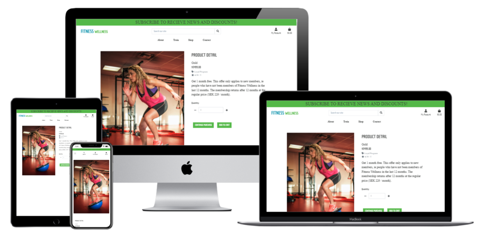
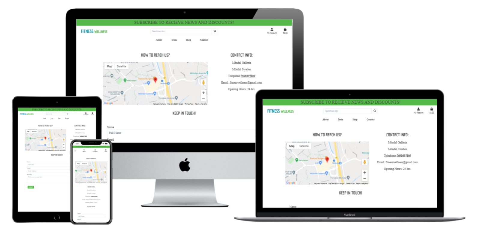
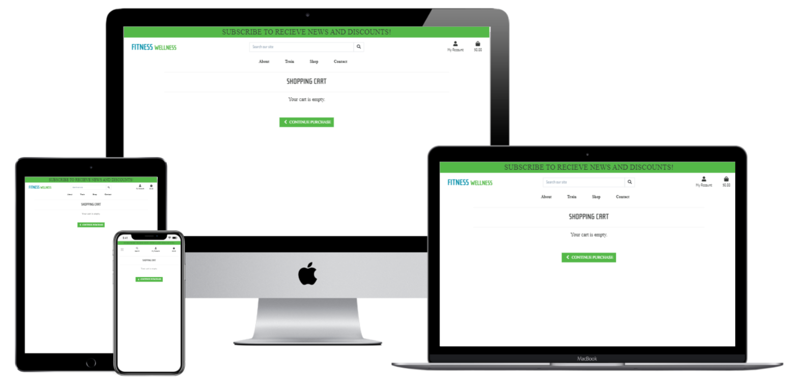
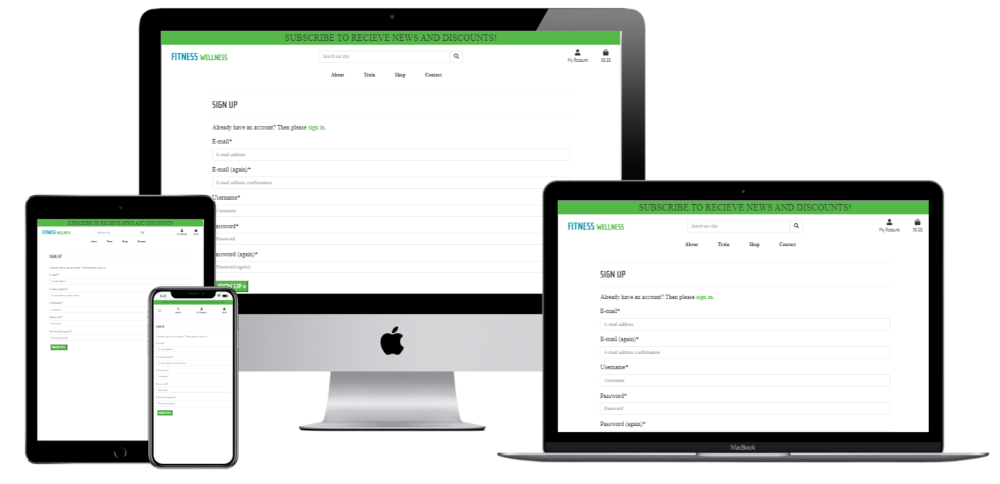
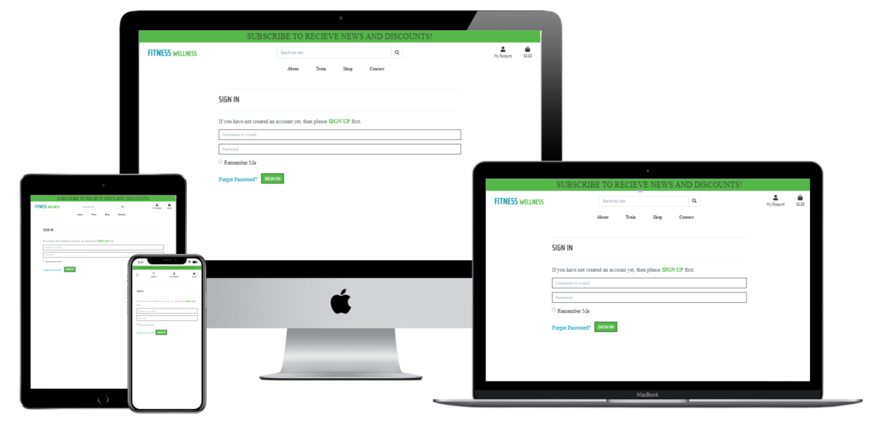
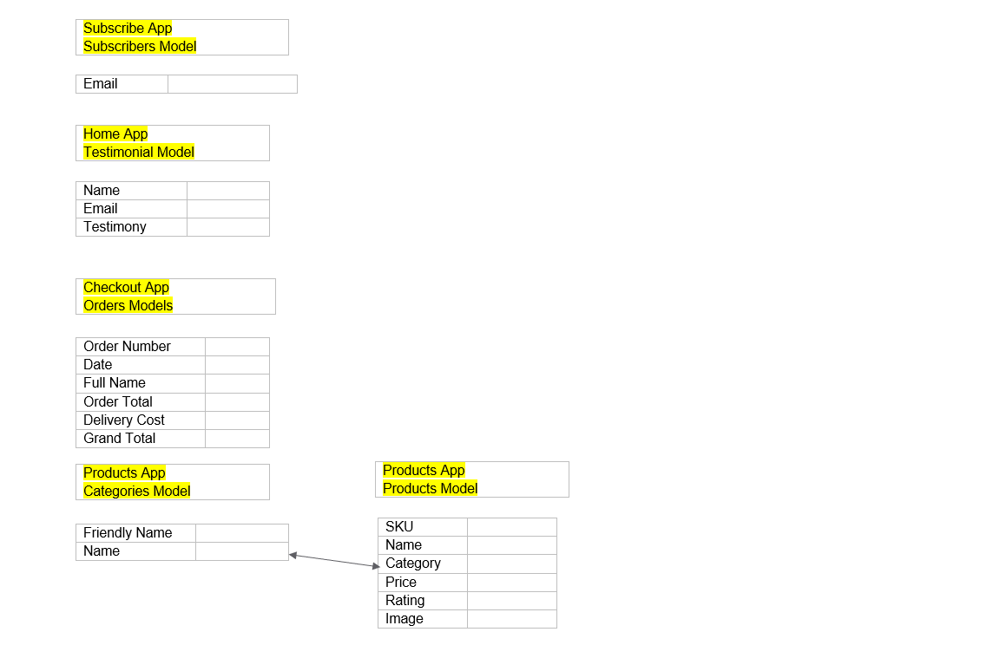

<h1 align="center">FITNESS WELLNESS</h1>
<h1 align="center"></h1>

-[Live Website](https://ms4-fitnesswellness.herokuapp.com/)

-[GitHub Repository](https://github.com/RubySrivastava/ms4-fitnesswellness)

## About

This project is made for the gym owner(admin) and users of the gym. It will be used by the users who wants to know more about gym and want to join program of the gym.
This is designed for the business purpose of the owner who wants to grow his business by his programs and products. 
The goal of this project was to allow the user to create an account and make a purchase of products with Stripe.
Although the majority of the admin activities is done through the Django admin site.
This project also provides more common tasks such as adding, editing and deleting products through the web app's UI. 
Because of sensitivity involved in handling customer details I had to approach development from a security conscious perspective. 
For site owners it will be utility to increase their presence over the internet which lead to increase their business by adding and selling more products.
It is designed to be responsive on all devices and easy to navigate for users and owner.

## Table of Contents

[User Experience (UX)](#UX)

[Features](#features)

[Design](#design)

[Technologies Used](#technologies)

[Testing](#testing)

[Deployment](#deployment)

[Known Bugs](#bugs)

[Credits](#credits)

## User Experience (UX)

### User Stories

This website will give information to the users about the gym and their facilities. 
It tells about how to being healthy with fitness activity. 
It provides the different offer on landing page which attract users which gives benefit to both user (Good health) and gym owner (Profitability).
In this website users can check and purchase gym products with safe and secure payment option.

- #### Generic User
    1. I want to easily understand the purpose and the layout of the site without additional instructions needed.
    1. I want to intuitively navigate through the site to browse the content.
    1. I want the site is responsive on all device as I usually use phone for doing all such type of stuff.
    1. I want to be able to use the website on any device so I can keep it handy.
    1. I want to use the navigation at all times and have it readily available so I can quickly navigate from one page to another.

- ####  Admin/Site Owner
    1. As a site owner I want to check all gym program and merchandise so that I can update those if it is required for business.
    1. As a site owner I want to add, edit and delete the products and programs plans.
    1. As a site owner I want to manage products by adding, deleting and removing if required.
    1. As a site owner I should be able to display testimonials of my users.
    1. As a site owner I have to secure user's sensitivity data.

- #### User who wants to know about gym program and products
    1. I want to check the products without login or sign up on site.
    1. I want to get products by search option.
    1. I want filter option for the products so that I can see only what I want.
    1. I want to contact the site owner by sending message without login or sign up.
    1. I want to request the site owner for newsletter without login or sign up.
    1. I want to look the contact details on contact page and map of address.
    1. I want to check any offers which should be on landing page and I can find easily.
    1. I want to know about gym what program they offer.
    1. I want to know about merchandise and detail description..
    1. I want to know about price details to check the price for different products.

- #### User who wants to be member of gym and/or buy the merchandise.
    1. I want to create my profile by sign up.
    1. I want to easliy login and check my page.
    1. I want to easily add products in my cart.
    1. I want to update my cart if I want to do.
    1. I want to be secure about my all personal data.
    1. I should be able to do the secure payment for purchasing.
    1. I want to get confirmation mail of my order.
    1. I want to save my all purchase in my profile.
    1. I want to request the site owner for newsletter
    1. I want to contact the admin for any query.

## Features

### Existing Features & Django Apps

- #### Common Features Across All Pages

    - Header allows user to easily navigate across all pages
      - The header itself is positioned to always be visible (positioned absolutely using Bootstrap 'fixed-top' class) at the top of the screen (mobile and desktop) which allows visitors to find it quickly.
      - There are two header on page. One is main navigation menu and other is mobile top header. 
      - The brand logo is positioned on the left and a search box. Both are visible on all pages .
      - Navigation is included in the header to let the user intuitively locate it.
      - Main navigation links collapse in a home menu when viewed on mobile device.
      - Mobile top header is visible on all device.
    
    - Accessibility
      - All Pages have a description in case the image link breaks as well as helps screen readers.
      - The home menu has aria-label added to let users with screen readers know where the toggleable menu is.

    - Search Functionality
      - A Search box is part of the top navigation and is, therefore, accessible on all pages.
      - On mobile and ipad the search bar is collapsed under the search symbol.
      - It allows customers to enter keywords associated with the products they wish to purchase.
    
    - Buttons/Links
      - All buttons are styled in the way to provide consistency across the page.
      - All links have a hover effect.
      - All external links open in a new tab to allow the user to easily navigate back to the page. 
    
    - Toast messages
      - They appear on every page whenever a certain action has been done by the user.
      - Their purpose is to give messages displayed at the right corner of the page to provide the user confirmation of actions like sign out, adding or editing products etc.

    - Django-allauth feature
      - django-allauth is a Python package. It provides a set of features such as signup, login, logout and password change and so many.
      - After signing up, a verification e-mail is sent to the registered e-mail to confirm it. Once confirmed, the user can log in with their credentials and access the profiles app.
    
    - Automatic e-mails
      - An account is working for this project and used as a sender for all verification, reset and confirmation e-mails.
    
    - Responsiveness
      - All Pages are responsive on different viewport size.

    - Footer
      - Footer has been designed to be at the bottom of the page, regardless of the amount of content. This aids the overall user experience.
      - All content has been spaced out and aligned to the center.
      - There are social links and when hovered over, it changed the color.

- #### Django App 
    - home 
    - gym
    - products
    - bag
    - checkout
    - profiles
    - subscribe
    - contact
    
- #### Specific to Pages

    - Home Page 
        - This page has header, footer and search box. This page has subsciber link for newsletter. This page has special offer link which directs to train page.Page contains testimonials of users with their names too.The image brings the user's attention and inviting the user to explore the website.
    
    - About Page
        - This page contains the information of gym.

    - Train Page
        - This page contains the list of programs based on category with image and price. Page has pagination and back to top button.

    - Shop Page
        - This page contains the list of products based on category with image and price. Page has pagination and back to top button.

    - Contact Page
        - This page contains a form where users can give feedback and ask questions. This Page has map and address details.

    - Register Page
        - This page has signup form. After registration user will reach on home page.

    - Login Page 
        - This page has login form. After login user will reach on home page.

    - Product Management Page
        - Only admin can access this page. In this page admin can manage products.

    - My Profile 
        - This page consist of user details like address and order details of respective user.

    - Logout Page
        - This page has logout form with confirmation button to logout.

    - Product Description Page
        - This page displays product description of selected product with add to cart and continue pruchase link.

    - Bag Page
        - This page has list of all products added to cart with secure checkout and continue purchase link.

    - Checkout Page
        - This page has form for user address deatils and other is for order summary. This page use for payment through stripe. This page adjust to cart and complete order link.

    - Checkout Success Page
        - This page has confirmation message of your payment for order. This page also contains orders and user deatils.

    - Subscribe Page
        - This page has subscribe form for getting the newsletter. Just by entering email address you become subscriber.

### Future Features
  - Create a way for the user to rate the website without having to type up feedback.
  - A page where people can write and read review of product.

     
## Design

### Colour 
      
- #### This website is design for gym lovers who likes to be fit and needs lots of motivation to be fit.
    Colors which are used for the site show intelligence and simplicity respectively.Because of this color the content looks simple and clear.
    
    Color #343735 is used for background and footer.
    
    
    
    Colors #000 and #fff are used for text-color. 
      
    
    

    Color #54b848 is used for background of buttons/links and note of the page. 
    
    

    Colors #888 and #bbb are used for testimonial next, prev and dots buttons.
    
    
    
      
### Typography

- #### The main font Rationale is used for brand name, mobile header, page heading and home text.
- #### The second font used is a Expo for main navbar, footer details and paragraphs.

### Icons

- #### In this project, icons provided by Font Awesome. The Icons that are used have functional purposes such as the hamburger menu and social media icons.

### Imagery

- #### 
    -[Image Optimizer](http://jpeg-optimizer.com/)

### Defensive Design

- #### The user is not able to break the site by clicking on buttons.
- #### The add and edit product form:
    - The category has to be chosen.
- #### Use the crispy form for validation.

### Mockups

- #### Mockups were created using Adobe Xd.
    -[Desktop Wireframes](https://xd.adobe.com/view/e5b451fc-02be-4aab-98af-23eafc864546-b0e7/)

    -[Ipad/Tablet Wireframes](https://xd.adobe.com/view/31f09f66-7c6d-47e4-8ad9-6bd0f8035361-64a3/)
    
    -[Mobile Wireframes](https://xd.adobe.com/view/71020ccd-d839-46ff-a08e-70ce4c856c3b-2451/)

- #### Mockup made through original website 
    -[Wireframes](https://techsini.com/multi-mockup/index.php)
    
    
    
    
    
    
    
    
    
    
    

### Data Schema

## Technologies Used

### Languages Used

  - [HTML5](https://en.wikipedia.org/wiki/HTML5)
  - [CSS3](https://en.wikipedia.org/wiki/Cascading_Style_Sheets)
  - [JavaScript](https://en.wikipedia.org/wiki/Javascript)
  - [Jquery](https://en.wikipedia.org/wiki/JQuery)
  - [Python](https://en.wikipedia.org/wiki/Python_(programming_language))

### Frameworks, Libraries and Programs Used

  - [Bootstrap v4.5.0](https://getbootstrap.com/) - Used for the responsive layout as well as custom components such as header, footer, images, icons, grids, cards, and collapse element.
  - [Font Awesome](https://fontawesome.com/) - Font Awesome is used to add social icons for socila links.
  - [Google Fonts](https://fonts.google.com/) - Google Fonts is used to import 'Expo' and 'Rationale'.
  - [Git](https://git-scm.com/) - Git is used to allow for tracking of any changes in the code and for the version control.
  - [GitPod](https://www.gitpod.io/) - GitPod, connected to GitHub, hosted the coding space and allowed the project to be committed to the Github repository.
  - [Github](https://github.com/) - GitHub is used to host the project files and publish the live website by using Git Pages.
  - [Heroku](https://www.heroku.com/) - Heroku is the cloud platform to deploying the app.
  - [Django](https://docs.djangoproject.com/en/3.2/) - Django is a high-level Python Web framework.
  - [Google API](https://cloud.google.com/docs) - Google APIs are application programming interfaces (APIs) used for google map which is google service.
  - [EmailJS](https://www.emailjs.com/) – Service that helps sending emails using client side technologies only. It only requires to connect EmailJS to one of the supported email services, create an email template, and use their Javascript library to trigger an email.
  - [Stripe](https://stripe.com/) – Allows individuals and businesses to make and receive payments over the Internet.
  - [AWS](http://aws.amazon.com/) - Amazon Web Services (AWS) is the most comprehensive and broadly adopted cloud platform used for S3 service.
  - [Adobe Xd](https://www.adobe.com/ie/products/xd.html) - Adobe Xd is used to create mockups.
  

### Database

  - [Heroku Postgres](https://www.postgresql.org/) - PostgreSQL is one of the world's most popular relational database management systems.
  

## Testing - [Find here](testing.md)

## Deployment

- ### AWS 
  1. Created a new Amazon account and connect to amazon service AWS3 account are cloud based serve where the project media and staicfiles will be stored unto. At first, we locate S3 on amazon service then we create a bucket. While creating the bucket on S3, the note that public access must be all switched off to allow access for users.

  2. Once we've created the bucket, we now can now click on it's properties and enable the Static Website Hosting option, so it can serve the purpose of hosting our static files, you will need to imput an index.html and error.html before saving. Then we go into the created bucket Permissions and click into CORS configuration, this part already have a prefilled default config, All that is needed is just to write the default code and save the config.

  3. Then we go into the bucket policy to allows access to the contents across all web and inside this we will put in here some code including arn address displayed at the top of the heading. Then we go into amazon IAM to allow identity and access management of our stored files and folder. In the IAM service, we add a new group for our application and then we set the policies to ALL Then it generates a downlaodable zip file containing ID and KEY for us to use for the newly added group. This ID and KEY as to be stored in an environment variable.

  4. This then allows us to into our terminal window and install some settings Boto3 Django Storages

  5. The Django Storages is passed into the installed apps in settings and also a custom_storage file is created to store credentials in environment variable. And once everything looks fine we can run python3 manage.py collectstatic. This will collect all the static files in our app including any changes that is made. N.B this command has to be run in the development(local) environment each time a change is been made in the static files/folder And your folder and files should display in your AWS S3 BUCKETS

- ### Heroku Deployment
  1. Set up local workspace for Heroku
     - In terminal window of your IDE type: pip3 freeze -- local > requirements.txt. (The file is needed for Heroku to know which filed to install.)
     - In termial window of your IDE type: python app.py > Procfile (The file is needed for Heroku to know which file is needed as entry point.)
  2. Set up Heroku: create a Heroku account and create a new app and select your region.
  3. Deployment method 'Github'
     - Click on the Connect to GitHub section in the deploy tab in Heroku.
       - Search your repository to connect with it.
       - When your repository appears click on connect to connect your repository with the Heroku.
    - Add PostgreSQL Database
       - Click the resources tab.
       - Under Add-ons seach for Heroku Postgres and then click on it when it appears.
       - Select Plan name Hobby Dev - Free and then click Submit Order Form.
    - Goto CLI
       - pip3 install dj_database_url
       - pip3 install psycopg2-binary
       - pip3 freeze > requirements.txt
    - Go to settings.py
       - import OS
       - import dj_database_url
       - Add postgres url and comment sqlite
    - Migrate data
    - Dumpdata from sqlite and loaddata to postgresql
    - pip3 install gunicorn
    - pip3 freeze > requirements.txt
    - Create Procfile
    - Set DISABLE_COLLECTSTATIC=1
    - In settings.py set ALLOWED_HOSTS
    - Git add, commit and push.
    - Git push heroku master
    - Go to the settings app in Heroku and go to Config Vars. Click on Reveal Config Vars.Enter the variables.
       - AWS_ACCESS_KEY_ID
       - AWS_SECRET_ACCESS_KEY
       - DATABASE_URL
       - EMAIL_HOST_PASS
       - EMAIL_HOST_USER
       - SECRET_KEY
       - STRIPE_PUBLIC_KEY
       - STRIPE_SECRET_KEY
       - STRIPE_WH_SECRET
       - USE_AWS 
  4. Automatic deployment: Go to the deploy tab in Heroku and scroll down to Aotmatic deployments. Click on Enable Automatic Deploys. By Manual deploy click on Deploy Branch.

  Heroku will receive the code from Github and host the app using the required packages. Click on Open app in the right corner of your Heroku account. The app wil open and the live link is available from the address bar. 

- ### Forking
  If you wish to contribute to this website you can Fork it without affecting the main branch by following the procedure outlined below.
  1. Go to the GitHub website and log in.
  2. Locate the [Repository](https://github.com/RubySrivastava/ms4-fitnesswellness) used for this project.
  3. On the right-hand side of the Repository name, you'll see the 'Fork' button. It's located next to the 'Star' and 'Watch' buttons.
  4. This will create a copy in your personal repository.
  5. Once you're finished making changes you can locate the 'New Pull Request' button just above the file listing in the original repository.

- ### Cloning 
  If you wish to clone or download this repository to your local device you can follow the procedure outlined below.
  1. Go to the GitHub website and log in.
  2. Locate the [Repository](https://github.com/RubySrivastava/ms4-fitnesswellness) used for this project.
  3. Under the Repository name locate 'Clone or Download' button in green.
  4. To clone the repository using HTTPS click the link under "Clone with HTTPS".
  5. Open your Terminal and go to a directory where you want the cloned directory to be copied in.
  6. Type `Git Clone` and paste the URL you copied from the GitHub.
  7. To create your local clone press `Enter`

## Known Bugs

- ### Pagination was not working with filtering.
   - The view forgot whatever filtering had applied, because that filtering is also controlled by query parameters, and these links don't include the filter's parameters.
   - I used template tag to build pagination links that preserve other query parameters used for filtering and got my pagination with filtering.

- ### Map was only displaying for a second and disappear from page after deployment on heroku.
   - The current URL loaded the Maps JavaScript API had not been added to the list of allowed referrers. So I added the url and I got the map.

## Credits

### Code :

- Bootstrap library was used to create a responsive design. 
 
### Content :

- All code was written by the Ruby Srivastava.

- To write up a README file the most helpful documents were
    - Code Institute [SampleREADME](https://github.com/Code-Institute-Solutions/SampleREADME)
    - Code Institute [README Template](https://github.com/Code-Institute-Solutions/readme-template)
    - [Markdown Cheatsheet](https://github.com/adam-p/markdown-here/wiki/Markdown-Cheatsheet#code)
    
- To write up the content of page the most helpful site is
    - NORDIC WELLNESS [Official Website](https://nordicwellness.se/)
    - FITNESS24SEVEN [Official Website](https://co.fitness24seven.com/en/)

### Media :
- All images used were taken from [UnSplash website](https://unsplash.com/)

### Acknowledgements :

- I was inspired by the people of surrounding me who wants to be fit and gyms are in thier regular routine.
- Thanks to my fellow students and tutors on slack channel who helped me in some way.
- Thanks to my reviewer who review it and help me to fix any error and bugs.
- Thanks to my mentor Maranatha Ilesalnmi who helped me throughout the project and gived me important suggestions and feedback of my work.
 
  
    